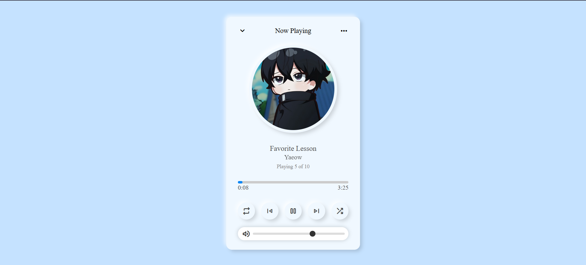

# 🎵 Modern Music Player

A clean and modern **Music Player App** built using **HTML**, **CSS**, and **JavaScript**.  
Designed with a smooth user interface and minimalist aesthetic, it allows users to play songs seamlessly, control volume, and navigate through a playlist.

## ✨ Features

- 🎧 Display of currently playing song (title, artist, album art)
- ⏯️ Play/Pause, Next, Previous, and Loop controls
- 🔀 Shuffle Song
- 📃 Playlist progress (e.g., "Playing 5 of 10")
- ⏱️ Dynamic progress bar with current and total time
- 🔊 Volume control slider
- 🎨 Stylish and responsive UI

## 🛠️ Tech Stack

- **HTML** — Structure of the player
- **CSS** — Styling with custom layout and effects
- **JavaScript** — Logic for audio control and UI interactivity

## 🎶 ENJOY YOUR SONG
Feel free to add more songs, change cover images, and edit your playlist by modifying the `playlist.js` file.

Made with ❤️ by [Jose]

